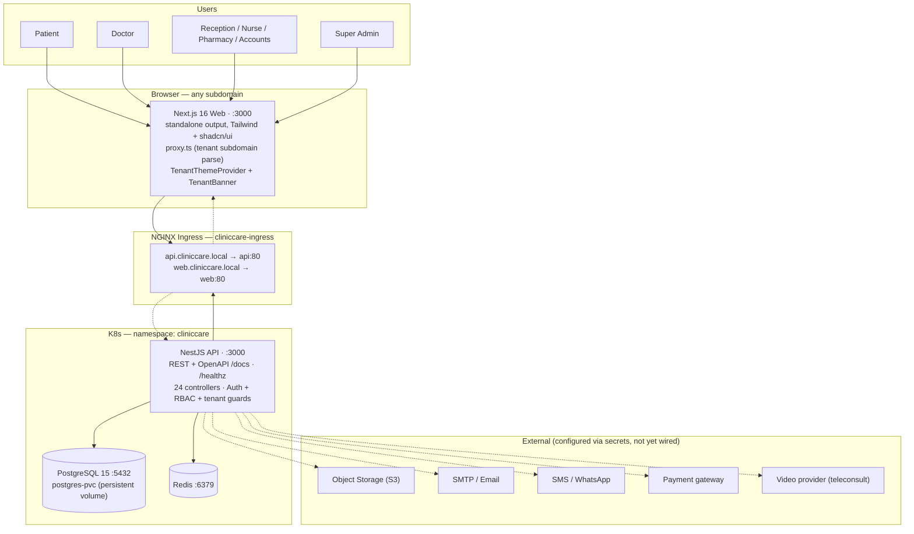
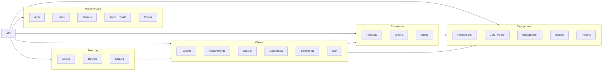
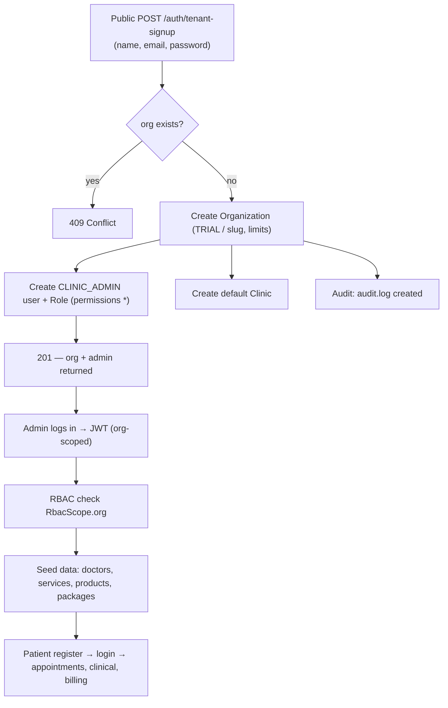
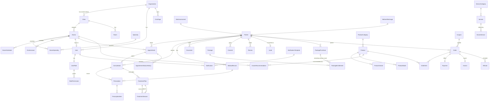
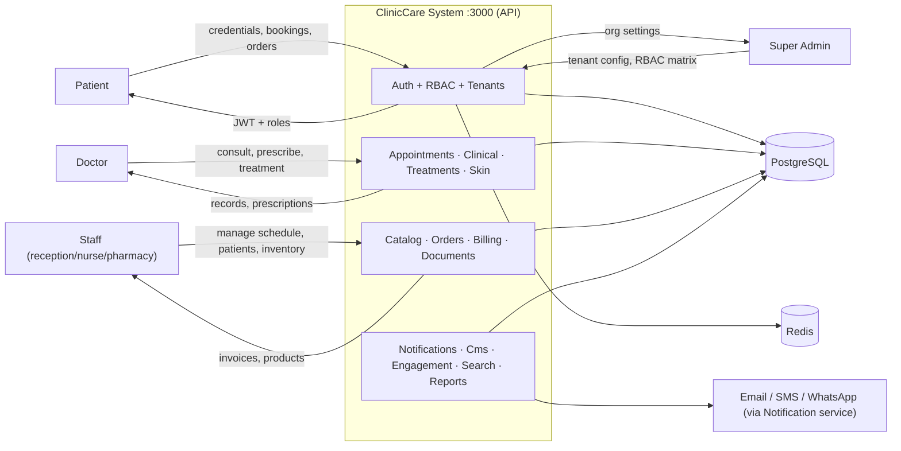
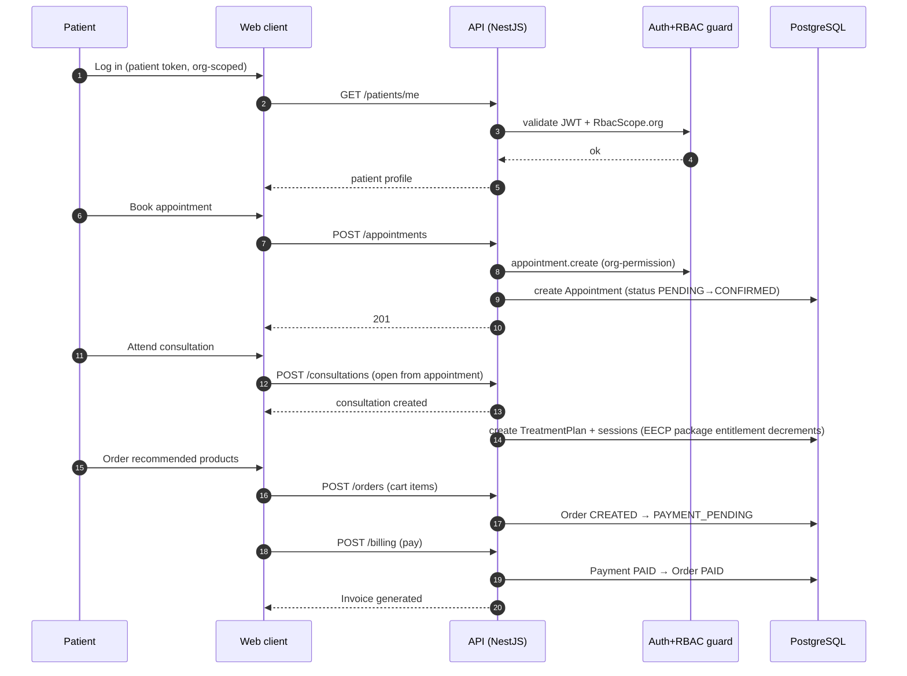
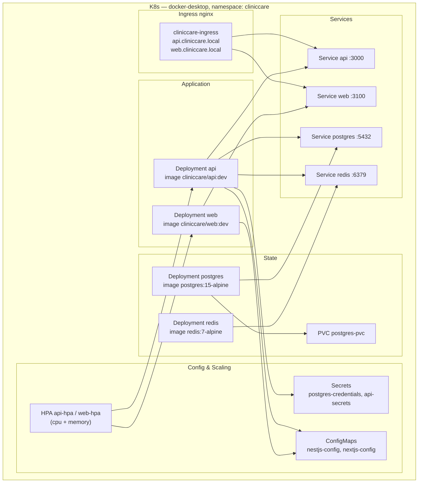
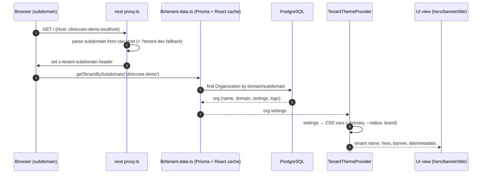
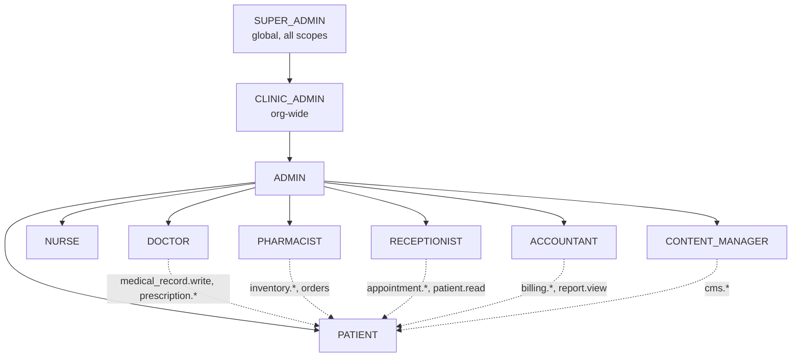

# ClinicCare — Architecture Diagrams

All diagrams reflect the **implemented** codebase (not the plan). Verified against:

- `apps/api/src` — NestJS, 24 module controllers, Prisma (40+ models, 15 enums)
- `apps/web` — Next.js 16 app router, Tailwind + shadcn/ui, tenant subdomain theming
- `infrastructure/k8s` — namespace `cliniccare`, Postgres/Redis/API/Web, HPA, ingress
- `prisma/schema.prisma` + `prisma/seed.ts`

Rendering: these are Mermaid diagrams — open this file in VS Code (Markdown Preview Mermaid) or paste each block at https://mermaid.live
> Browse rendered, per-diagram HTML pages (one page per diagram, Mermaid v11 via CDN):
> [`docs/diagrams/index.html`](diagrams/index.html)

---

## 1. System / Container Architecture

---

## 2. Block / Module Diagram — API (NestJS)

---

## 3. Business Flow — Tenant Signup (Auth)

---

## 4. ER Diagram — Core Domains

---

## 5. DFD — Level 0 (Context)

---

## 6. Sequence — Consultation → Prescription → Order (Commerce)

---

## 7. Deployment / K8s Topology

---

## 8. Tenant Theming — Web Runtime (middleware → theme)

---

## 9. RBAC Matrix (implemented roles)

