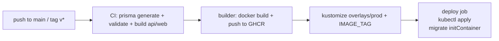

# ClinicCare — Cloud Runbook (build + deploy)

Production deploys go through the GitHub Actions pipeline and target the
`infrastructure/k8s/overlays/prod` overlay. This runbook covers build, push,
deploy, migrations, secrets, TLS, backups, and rollback.



## Prereqs

- GitHub repo `Pankajshukla2282/cliniccare`; default branch `development`,
  `main` is the deploy branch.
- GHCR access is automatic — the workflow uses the built-in `GITHUB_TOKEN`
  with **Packages: write**. Confirm repo → Settings → Actions → General →
  "Workflow permissions" is set to **Read and write**.
- (Optional, for automated deploy) a kubeconfig for the prod cluster stored as
  repo/org secret **`KUBE_CONFIG_B64`** (base64 of `~/.kube/config`). If absent
  the pipeline still builds/pushes/renderes but skips the deploy job.
- Prod cluster is the only drift source: apply with the same overlay,
  tag-for-tag, so the cluster matches the rendered artifact.

## Build

Any of: push to `main`, push a tag `vX.Y.Z`, or `workflow_dispatch` from the
Actions tab.

**Pipeline jobs** (`build-deploy.yml`):

1. **build-and-push** (matrix: api, web)
   - api  → `ghcr.io/Pankajshukla2282/cliniccare-api:sha-<short>`
   - web  → `ghcr.io/Pankajshukla2282/cliniccare-web:sha-<short>`
   - plus a moving tag: `main` for branch pushes, `vX.Y.Z` for tags.
   - Web build bakes `NEXT_PUBLIC_API_URL=https://api.cliniccare.example`.
   - Deps are cached on the GitHub cache (GHA buildx cache) — rebuilds are fast.
2. **render** — runs
   `kubectl kustomize infrastructure/k8s/overlays/prod --load-restrictor LoadRestrictionsNone |
   sed "s/__IMAGE_TAG__/sha-<short>/g"`
   and uploads `cliniccare-prod.yaml` as an artifact.
3. **deploy** *(only if `KUBE_CONFIG_B64` is set)* — installs the kubeconfig,
   `kubectl apply -f cliniccare-prod.yaml`, then
   `kubectl rollout status deploy/api deploy/web -n cliniccare`.

The `main` deploy tag's content is what's pinned to `__IMAGE_TAG__`; each run
pins all pods to that run's `sha-<short>`.

## Deploy

### Automated (preferred)

Push to `main` (or a `v*` tag) → the pipeline builds, pushes, renders, and
applies. Migrations are **automatic**: every new api pod runs
`npx prisma migrate deploy` in its `migrate` initContainer before serving,
so schema changes ride along with the code push (migration files live in
`prisma/migrations/`, excluded from `.dockerignore`).

```powershell
git switch main
git merge development  # or: git push origin development:main
git push origin main   # fires build-deploy
```

For a release tag:

```powershell
git tag v1.2.0 && git push origin v1.2.0
```

### Manual fallback (no Actions / breach drill)

```powershell
# from the repo root — docker must be logged into GHCR (KUBE_CONFIG for cluster)
$tag = "sha-$((git rev-parse --short HEAD))"
docker build -t ghcr.io/Pankajshukla2282/cliniccare-api:$tag -f apps/api/Dockerfile .
docker build -t ghcr.io/Pankajshukla2282/cliniccare-web:$tag -f apps/web/Dockerfile .
docker push ghcr.io/Pankajshukla2282/cliniccare-api:$tag
docker push ghcr.io/Pankajshukla2282/cliniccare-web:$tag

kubectl kustomize infrastructure/k8s/overlays/prod --load-restrictor LoadRestrictionsNone |
  sed "s/__IMAGE_TAG__/$tag/g" | kubectl apply -f -
kubectl -n cliniccare rollout status deploy/api deploy/web --timeout=300s
```

Preview the rendered manifests before applying:

```powershell
kubectl kustomize infrastructure/k8s/overlays/prod --load-restrictor LoadRestrictionsNone |
  sed "s/__IMAGE_TAG__/sha-deadbeef/g"
```

## Migrations

- **Apply**: automatic via the `migrate` initContainer in `base/20-api.yaml`
  (`npx prisma migrate deploy`). Never use `db push` on a shared DB — only
  additive migrations in `prisma/migrations/`.
- **Local, against a tunnel to prod DB** (e.g. after a rollback):
  `npx prisma migrate deploy`.
- **Verify a migration ran**:
  `kubectl -n cliniccare exec deploy/api -- npx prisma migrate status`.
- Env for the CLI comes from root `.env` (Prisma reads `DATABASE_URL` from
  `prisma.config.ts` via `dotenv`).

## Secrets

Secrets are created by Kustomize from the repo-root `.env` via
`secretGenerator` in `base/kustomization.yaml` — the pipeline's render job
reads `.env`, and the overlay keeps the same source. This works today but is a
known simplification for a shared environment. **Before real user data:**

1. Remove real values from `.env`.
2. Create the two Secrets out-of-band from your cloud secret manager
   (AWS SSM Parameter Store / Sealed Secrets / SOPS), same names:
   - `postgres-credentials` — `POSTGRES_USER`, `POSTGRES_PASSWORD`, `POSTGRES_DB`
   - `api-secrets` — `JWT_SECRET`, `DATABASE_URL`, `SEED_ADMIN_PASSWORD`,
     `SEED_SUPER_ADMIN_PASSWORD`, and any provider keys
3. Optionally mask the `secretGenerator` (remove `api-secrets` from the
   generator) so nothing CI-renderable touches the secret.

## TLS

`base/40-ingress.yaml` terminates HTTP at the ingress. For TLS:

- Managed K8s + cert-manager:

```yaml
metadata:
  annotations:
    cert-manager.io/cluster-issuer: letsencrypt-prod
spec:
  tls:
    - hosts: [web.cliniccare.example, api.cliniccare.example, cliniccare-demo.cliniccare.example]
      secretName: cliniccare-tls
```

- Cloud LB (ALB/GKE Ingress): enable the platform's managed certificate and
  point DNS A-records at the ingress address.

Then flip `CORS_ORIGIN` / `NEXT_PUBLIC_API_URL` to the `https://` hosts in the
prod overlay.

## Backups

`base/70-backup.yaml` runs a **daily 02:00** `pg_dump` (custom format) into a
PVC and keeps the newest 7 dumps.

- Preview/trigger a manual run:

```powershell
kubectl -n cliniccare get cronjob postgres-backup
kubectl -n cliniccare create job --from=cronjob/postgres-backup manual-backup
```

- Restore (point-in-time) into a new database:

```powershell
kubectl -n cliniccare exec deploy/postgres -- bash -c \
  'pg_restore -U "$POSTGRES_USER" -d "$POSTGRES_DB" --clean --if-exists < /dev/stdin' |  # for files outside the pod
# simpler: exec a shell in the pod, pg_restore the newest dump from /backups
```

- For production, replace or augment the PVC dump with an object-store backup
  (upload the `.dump` to S3/GCS in the job command) and snapshot the postgres
  PVC — see the comments at the top of `70-backup.yaml`.

## Rollback

Each deploy pins a `sha-<short>` tag. To roll back, re-apply the previous
rendered artifact (or re-render with the old tag):

```powershell
# reuse a previously downloaded artifact
kubectl apply -f cliniccare-prod.yaml.prior
# or re-render with the previous sha
kubectl kustomize infrastructure/k8s/overlays/prod --load-restrictor LoadRestrictionsNone |
  sed "s/__IMAGE_TAG__/sha-<PREVIOUS>/g" | kubectl apply -f -
```

Migrations are forward-only: if a release shipped a destructive migration,
don't roll the DB back with the code — restore the PreV from backup and use
`prisma migrate deploy` on the pinned code.

## Observability

```powershell
kubectl -n cliniccare get pods,deploy,hpa,pdb,cronjob
kubectl -n cliniccare get ing                      # ingress address + TLS
kubectl -n cliniccare rollout status deploy/api    # deploy signal
kubectl -n cliniccare logs -l app=api --tail=100   # NestJS logs (healthz every ~10s)
```

Health endpoints: `https://api.cliniccare.example/healthz` and
`https://web.cliniccare.example/healthz` → HTTP 200. The Docker HEALTHCHECK
and the k8s liveness/readiness probes all use these.